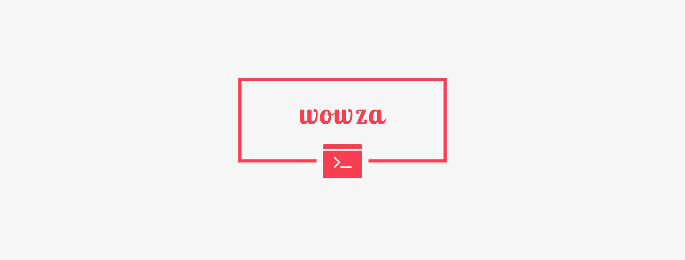

<p style="text-align: center;"></p>

<div style="text-align: center;">

[](https://circleci.com/gh/nrwl/nx)
[]()
[](https://github.com/semantic-release/semantic-release)
[](http://commitizen.github.io/cz-cli/)
[](https://join.slack.com/t/wowzacommunity/shared_invite/zt-phx09lkz-ETbJ8JAcqJkV9NhRRJpzPA)

</div>
<div style="text-align: center;">


</div>

<hr>

# What is Wowza?

❤️ **More hacking, less setup.**

## Wowza saves you time

Wowza sets up initial scaffolding for JS/TS projects so you can start working sooner. This setup includes...

- A dope `README.md` for your contributors to appreciate, with _badges_!
- `.gitignore` based on project type, and [where to find others](https://github.com/github/gitignore)
- Modern tooling: Cypress, ESLint (Airbnb), Jest, Prettier, Semantic Release, Storybook
- CI/CD pipeline to deploy to your destination of choice
- VS Code extensions by project type, and some that are useful for all
- Opt into an Nx monorepo ([why?](https://nx.dev/))

# Getting Started

## Creating a Wowza Project

**Using `npx`**

```bash
npx wowza
```

The `wowza` command will ask you [TODO], which will configure some plugins and scaffolding to help you get started.

```
? [TODO] (Use arrow keys)
❯ empty             [an empty workspace with a layout that works best for building apps]
  oss               [an empty workspace with a layout that works best for open-source projects]
  angular           [a workspace with a single Angular application]
  react             [a workspace with a single React application]
```

## Serving Application

- Run `nx serve myapp` to serve the newly generated application!
- Run `nx test myapp` to test it.
- Run `nx e2e myapp-e2e` to run e2e tests for it.

Angular users can also run `ng g/serve/test/e2e`.

You are good to go!

## Resources

### Documentation

- [Nx Documentation and Guides](https://nx.dev)

### Quick Start Videos

<table>
  <tr>
    <td>    
      <a href="https://www.youtube.com/watch?v=mVKMse-gFBI" target="_blank">
      <p style="text-align: center;">Angular<br></p>
      </a>
    </td>
    <td>    
      <a href="https://www.youtube.com/watch?v=E188J7E_MDU" target="_blank">
      <p style="text-align: center;">React<br></p>
      </a>
    </td>
  </tr>
</table>

### Courses

<table>
  <tr>
    <td><strong>Scale React Development with Nx</strong></td>
    <td><strong>Nx Workspaces</strong></td>
    <td><strong>Advanced Nx Workspaces</strong></td>
  </tr>
  <tr>
    <td>
      <a href="https://egghead.io/playlists/scale-react-development-with-nx-4038" target="_blank">
      <p style="text-align: center;"></p>
      </a>
    </td>
    <td>
      <a href="https://www.youtube.com/watch?v=2mYLe9Kp9VM&list=PLakNactNC1dH38AfqmwabvOszDmKriGco" target="_blank">
        <p style="text-align: center;"></p>
      </a>
    </td>
    <td>  
      <a href="https://nxplaybook.com/p/advanced-nx-workspaces" target="_blank">
      <p style="text-align: center;"></p>
      </a>
    </td>
  </tr>
</table>

### Nx Demo & Tutorial Videos

- [Nx Dev Tools for Monorepos, In-Depth Explainer (React)](https://www.youtube.com/watch?v=jCf92IyR-GE)

- [Nx Dev Tools for Monorepos, In-Depth Explainer (Angular)](https://youtu.be/h5FIGDn5YM0)

- [Storybook Integration with Nx](https://youtu.be/sFpqyjT7u4s)

- [Building Custom Plugins for Nx](https://youtu.be/XYO689PAhow)

- [Improved Dependency Graph Visualization for Nx](https://youtu.be/cMZ-ReC-jWU)

- [Group all your stories into a single viewable Storybook with Nx](https://youtu.be/c323HOuFKkA)

- [Debug Nx with Node and VSCode](https://youtu.be/OGV4R0cPRPc)

- [Debug your Jest tests in Nx with VSCode](https://youtu.be/9_lgM2nokLg)

- [Nx Console - A Must-Have Visual Studio Code Extension for Angular Developers](https://youtu.be/IIetmfgozgI)

- [Introducing Nx Cloud](https://youtu.be/pwG20nNTEQc)

- [Setting up distributed caching using Nx Cloud, @nrwl/nx-cloud](https://youtu.be/w1-GiB74ddc)

- [High Quality React apps with Nx & Cypress](https://youtu.be/mfJBLhjYMdo)

### Books and Blogs

- [Nx blog posts](https://blog.nrwl.io/nx/home)

- [Angular Enterprise Monorepo Patterns Book (free)](https://go.nrwl.io/angular-enterprise-monorepo-patterns-new-book?utm_campaign=Book%3A%20Monorepo%20Patterns%2C%20Jan%202019&utm_source=Github&utm_medium=Banner%20Ad)

- [High Quality React apps with Nx & Cypress](https://cypress.io/blog/2020/04/14/high-quality-react-apps-with-nx-cypress/) (April 2020)

- [Shell Library patterns with Nx and Monorepo Architectures](https://indepth.dev/the-shell-library-patterns-with-nx-and-monorepo-architectures/) (March 2020)

- [Tiny Angular application projects in Nx workspaces](https://indepth.dev/tiny-angular-application-projects-in-nx-workspaces/#peer-reviewers--30/) (March 2020)

### Additional Resources

- [nx-examples](https://github.com/nrwl/nx-examples) repo has branches for different nx comments to display expected behavior and example app and libraries. Check out the branch (workspace, ngrx...) to see what gets created for you. More info on readme.

- [xplat - Cross-platform tools for Nx workspaces](https://nstudio.io/xplat/)
- [Nrwl Talks, Presentations, and Podcasts playlist on YouTube](https://www.youtube.com/playlist?list=PLakNactNC1dHHWx4JIORwfnEajRv6FG5m)

- [Nx Office Hours playlist on YouTube](https://www.youtube.com/playlist?list=PLakNactNC1dE8KLQ5zd3fQwu_yQHjTmR5)

## Want to help?

If you want to file a bug or submit a PR, read up on our [guidelines for contributing](https://github.com/nrwl/nx/blob/master/CONTRIBUTING.md) and watch this video that will help you get started.

<a href="https://www.youtube.com/watch?v=o11p0zSm0No&feature=youtu.be" target="_blank">
<p style="text-align: center;"></p>
</a>

## Core Team

| Victor Savkin                                                          | Jason Jean                                                            | Benjamin Cabanes                                                            | Brandon Roberts                                                          |
| ---------------------------------------------------------------------- | --------------------------------------------------------------------- | --------------------------------------------------------------------------- | ------------------------------------------------------------------------ |
|  |  |  |  |
| [vsavkin](https://github.com/vsavkin)                                  | [FrozenPandaz](https://github.com/FrozenPandaz)                       | [bcabanes](https://github.com/bcabanes)                                     | [brandonroberts](https://github.com/brandonroberts)                      |

| Jack Hsu                                                              | Jo Hanna Pearce                                                               | Jon Cammisuli                                                                | Isaac Mann                                                           |
| --------------------------------------------------------------------- | ----------------------------------------------------------------------------- | ---------------------------------------------------------------------------- | -------------------------------------------------------------------- |
|  |  |  |  |
| [jaysoo](https://github.com/jaysoo)                                   | [jdpearce](https://github.com/jdpearce)                                       | [cammisuli](https://github.com/cammisuli)                                    | [isaacplmann](https://github.com/isaacplmann)                        |

| Tasos Bekos                                                              | Juri Strumpflohner                                                               | Philip Fulcher                                                            | Katerina Skroumpelou                                                                |
| ------------------------------------------------------------------------ | -------------------------------------------------------------------------------- | ------------------------------------------------------------------------- | ----------------------------------------------------------------------------------- |
|  |  |  |  |
| [bekos](https://github.com/bekos)                                        | [juristr](https://github.com/juristr)                                            | [philipjfulcher](https://github.com/philipjfulcher)                       | [mandarini](https://github.com/mandarini)                                           |

| Kirils Ladovs                                                               |
| --------------------------------------------------------------------------- |
|  |
| [kirjai](https://github.com/kirjai)                                         |
